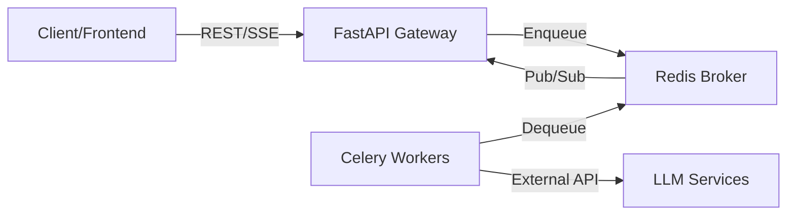
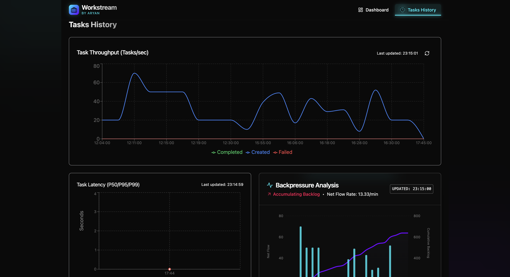

# Workstream

**High-Performance Distributed Task Processing Engine**

Workstream is a production-grade asynchronous task execution system designed for reliability and scale. It decouples long-running operations from the main application flow using a robust FastAPI + Redis + Celery architecture, featuring custom circuit breakers, distributed rate limiting, and real-time SSE monitoring.

    

---

## Table of Contents
- [Architecture](#-architecture)
- [Key Technical Features](#-key-technical-features)
- [Monitoring](#-monitoring)
- [Setup & Deployment](#-setup--deployment)
- [Usage](#-usage)
- [API Reference](#-api-reference)
- [Distributed Rate Limiting](#-distributed-rate-limiting)
- [Performance Management](#-performance-management)
- [Redis Data Structures](#-redis-data-structures)

---

## 🏗 Architecture

The system employs a microservices architecture orchestrated via Docker Compose:



### Tech Stack
*   **Backend**: Python, FastAPI
*   **Frontend**: React, TypeScript, Vite, Tailwind CSS
*   **Task Queue**: Custom Redis-based implementation
*   **Infrastructure**: Docker, Docker Compose
*   **Package Management**: `uv` for Python, `pnpm` for Frontend

### Key Components
*   **API Service**: A FastAPI application that exposes endpoints for task creation, management, and monitoring.
*   **Worker Service**: A pool of workers responsible for executing the actual tasks. They consume tasks directly from Redis queues.
*   **Frontend Application**: A React-based single-page application for real-time monitoring and management.
*   **Redis**: Acts as the message broker, task metadata store, and metrics database.

### Data Flow & Task Lifecycle
1.  **Task Creation**: Client requests `POST /api/v1/tasks/summarize/`.
2.  **Metadata Storage**: API creates `task:{uuid}` hash in Redis with `PENDING` state.
3.  **Queueing**: Task ID pushed to `tasks:pending:primary` list.
4.  **Real-time Update**: Update published to `queue-updates` channel (streamed to frontend).
5.  **Consumption**: Worker pulls task ID via `BLPOP`.
6.  **Execution**: Worker updates state to `ACTIVE`, executes task (e.g., LLM API call).
7.  **Completion**:
    *   **Success**: State -> `COMPLETED`, result stored.
    *   **Failure**: State -> `FAILED`. If retries left, moved to `tasks:scheduled`. If exhausted, moved to `dlq:tasks`.
8.  **Monitoring**: All state changes broadcast via Pub/Sub for real-time dashboard updates.

---

## 🚀 Key Technical Features

*   **Distributed Rate Limiting**: Redis-backed Token Bucket algorithm ensures global compliance with external API limits.
*   **Circuit Breaker Pattern**: Fails fast during external service outages to prevent cascading failures.
*   **Smart Caching**: Request-tier caching reduces external service checks by ~95%.
*   **Resilience**: Automatic retries with exponential backoff and Dead Letter Queue (DLQ) isolation.

---

## 📸 Monitoring

**Real-time Dashboard**


**Tasks History**


**Task Details**


---

## 🛠 Setup & Deployment

### Prerequisites
*   Docker & Docker Compose
*   Git

### Quick Start
```bash
# 1. Clone
git clone https://github.com/ARYAN-ark-1/Workstream.git
cd workstream

# 2. Configure
cp .env.example .env

# 3. Launch
docker compose up -d --build
```

**Services:**
*   **Dashboard**: [http://localhost:3000](http://localhost:3000)
*   **API Documentation**: [http://localhost:8000/docs](http://localhost:8000/docs)

---

## 📖 Usage

*   **Create Tasks**: Use API endpoints or utility scripts.
*   **Monitor System**: View real-time queue depths and worker status on the Frontend UI.
*   **Manage Tasks**: Check status, retry failed tasks, or delete via API.

---

## 🔌 API Reference

### Health Checks
*   `GET /health`: System health
*   `GET /live` / `GET /ready`: Liveness/Readiness probes

### Task Creation
*   `POST /api/v1/tasks/summarize/`: Create text summarization task
*   `POST /api/v1/tasks/pdfxtract`: Create PDF extraction task

### Generic Task Management
*   `GET /api/v1/tasks/`: List tasks (filter by status)
*   `GET /api/v1/tasks/{task_id}`: Get task details
*   `POST /api/v1/tasks/{task_id}/retry`: Retry failed/DLQ task
*   `DELETE /api/v1/tasks/{task_id}`: Delete task data
*   `POST /api/v1/tasks/requeue-orphaned`: Recover orphaned `PENDING` tasks

### Queue & Worker Management
*   `GET /api/v1/queues/status`: Queue depth snapshot
*   `GET /api/v1/queues/status/stream`: Real-time SSE stream
*   `GET /api/v1/workers/`: Worker health & circuit breaker status
*   `POST /api/v1/workers/reset-circuit-breaker`: Reset all circuit breakers

### OpenRouter Service Management
*   `GET /api/v1/openrouter/status`: Service status with intelligent caching (~50ms response)
*   `GET /api/v1/openrouter/metrics`: Usage metrics and analytics

---

## 🚦 Distributed Rate Limiting

Workstream includes a sophisticated distributed rate limiting system that coordinates API usage across all worker instances to respect external service limits (e.g., OpenRouter API rate limits).

### Overview

The rate limiting system uses a **Redis-based Token Bucket algorithm** to ensure that all workers collectively respect the global rate limits imposed by external APIs. This prevents violations that could cause task failures and service disruptions.

### Key Features

*   **Distributed Coordination**: All workers share the same token bucket stored in Redis.
*   **Dynamic Configuration**: Rate limits are automatically updated from API responses.
*   **Atomic Operations**: Uses Redis **Lua scripts** to prevent race conditions.
*   **Intelligent Waiting**: Workers wait for tokens to become available rather than failing immediately.
*   **Real-time Monitoring**: Provides detailed metrics on rate limit utilization.

### How It Works

1.  **Configuration Discovery**: The system fetches rate limit information from the API (e.g., 230 requests/10s).
2.  **Token Bucket Management**: A shared Redis bucket maintains:
    *   **Capacity**: Max tokens.
    *   **Refill Rate**: Tokens added per second.
    *   **Current Tokens**: Available tokens.
3.  **Request Coordination**:
    *   Workers atomically acquire a token using a **Redis Lua script**.
    *   This ensures concurrency safety.
    *   Workers wait (with timeout) if no tokens are available.
4.  **Automatic Refill**: Tokens are continuously added based on the refill rate.

### Usage Examples

**Automatic Rate Limiting (Recommended)**
```python
# Automatically uses the distributed rate limiter
result = await call_openrouter_api(messages)
```

**Manual Rate Limiting**
```python
from rate_limiter import wait_for_rate_limit_token

if await wait_for_rate_limit_token(tokens=1, timeout=30.0):
    result = await make_api_call()
else:
    raise Exception("Rate limit token timeout")
```

---

## ⚡ Performance Management

System performance can be tuned via `.env` variables:

*   `WORKER_REPLICAS`: Scalar number of worker containers.
*   `CELERY_WORKER_CONCURRENCY`: Threads/Processes per worker.
*   `WORKER_PREFETCH_MULTIPLIER`: Tasks fetched per batch.
*   `WORKER_MEMORY_LIMIT`: Docker resource constraints.

### OpenRouter State Management Optimization

Workstream includes an advanced state management system that dramatically improves API performance:

*   **Intelligent Caching**: Status checks cached for 1 minute (5-10s -> ~50ms response).
*   **Call Reduction**: Reduces overhead by ~95% by using cached data until stale.
*   **Circuit Breaker**: Coordinates failure tracking across all workers.
*   **Real-time Propagation**: Immediate reporting of rate limits or credit exhaustion.

**Performance Benefits:**
*   **Response Time**: ~99% improvement.
*   **Reliability**: Unified error handling across distributed workers.

---

## 🧠 Redis Data Structures

### Task Queues
*   `tasks:pending:primary` (List): FIFO queue for new tasks
*   `tasks:pending:retry` (List): FIFO queue for immediate retries
*   `tasks:scheduled` (Sorted Set): Delayed retries (scored by timestamp)
*   `dlq:tasks` (List): Dead Letter Queue

### Task Metadata
*   `task:{uuid}` (Hash): Stores content, state (`PENDING`, `ACTIVE`, `COMPLETED`, `FAILED`, `SCHEDULED`, `DLQ`), and result.
*   `dlq:task:{uuid}` (Hash): Snapshot of task data upon entering DLQ.

### Monitoring & Metrics
*   `worker:heartbeat:{worker-id}` (String): Worker liveness key
*   `queue-updates` (Pub/Sub): Channel for real-time frontend updates

### Rate Limiting & External API
*   `openrouter:rate_limit_config` (Hash): Max requests, interval
*   `openrouter:rate_limit:bucket` (Hash): Tokens, capacity, refill rate
*   `openrouter:credits` (Hash): Balance, usage
*   `openrouter:state` (Hash): Centralized service state
*   `openrouter:metrics:{date}` (Hash): Daily call stats

### Worker Management
*   `circuit_breaker:{service}` (Hash): State (`CLOSED`, `OPEN`, `HALF_OPEN`), failure counts
*   `worker:active_tasks:{worker-id}` (Set): Tasks currently processing
*   `worker:stats:{worker-id}` (Hash): Completed/failed counts

---

**Created by ARYAN**
