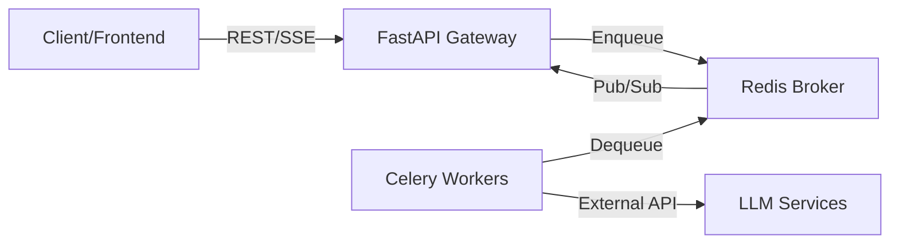
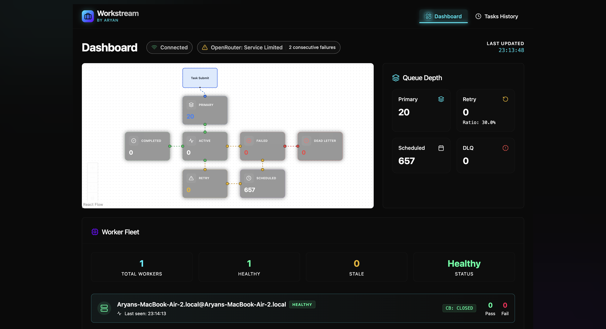
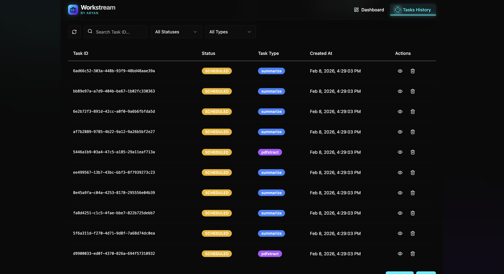

# Workstream

**High-Performance Distributed Task Processing Engine**

Workstream is a production-grade asynchronous task execution system designed for reliability and scale. It decouples long-running operations from the main application flow using a robust FastAPI + Redis + Celery architecture, featuring custom circuit breakers, distributed rate limiting, and real-time SSE monitoring.

    

---

## 🏗 Architecture

The system employs a microservices architecture orchestrated via Docker Compose:



### Core Components
*   **API Gateway (FastAPI)**: Async REST endpoints for task submission and management. Streams real-time updates via Server-Sent Events (SSE).
*   **Task Broker (Redis)**: Implements custom FIFO queues, Dead Letter Queues (DLQ), and pub/sub channels for state propagation.
*   **Worker Engine (Celery)**: Scalable worker pool with distinct queues (`primary`, `retry`, `dlq`). Handles task execution, retries with exponential backoff, and failure recovery.
*   **Frontend (React + Vite)**: Real-time dashboard using React Query and TailwindCSS for monitoring queue depth, throughput, and worker health.

---

## 🚀 Key Technical Features

*   **Distributed Rate Limiting**: Redis-backed Token Bucket algorithm (Lua scripts) ensures global compliance with external API limits across all worker nodes.
*   **Circuit Breaker Pattern**: Fails fast during external service outages to prevent cascading failures. Auto-recovers after a cooling period.
*   **Smart Caching**: Request-tier caching for stable external service status checks (reduces overhead by ~95%).
*   **Resilience**:
    *   **Automatic Retries**: Configurable backoff strategies.
    *   **Dead Letter Queue (DLQ)**: Isolates permanently failed tasks for manual inspection.
    *   **Atomic State Transitions**: Redis transactions ensure data integrity.

---

## 🛠 Setup & Deployment

### Prerequisites
*   Docker & Docker Compose
*   Git

### Quick Start
```bash
# 1. Clone
git clone https://github.com/ARYAN-ark-1/Workstream.git
cd workstream

# 2. Configure
cp .env.example .env

# 3. Launch
docker compose up -d --build
```

**Services:**
*   **Dashboard**: [http://localhost:3000](http://localhost:3000)
*   **API Documentation**: [http://localhost:8000/docs](http://localhost:8000/docs)

---

## 📸 Monitoring

**Real-time Dashboard**


**Task Inspection**


---

## 🔌 API Reference

| Method | Endpoint | Description |
| :--- | :--- | :--- |
| `POST` | `/api/v1/tasks/summarize/` | Submit text summarization task |
| `GET` | `/api/v1/tasks/{id}` | Get task status & result |
| `GET` | `/api/v1/queues/status/stream` | Real-time SSE metrics stream |
| `GET` | `/api/v1/workers/` | Worker health & circuit breaker status |

---

**Created by ARYAN**
